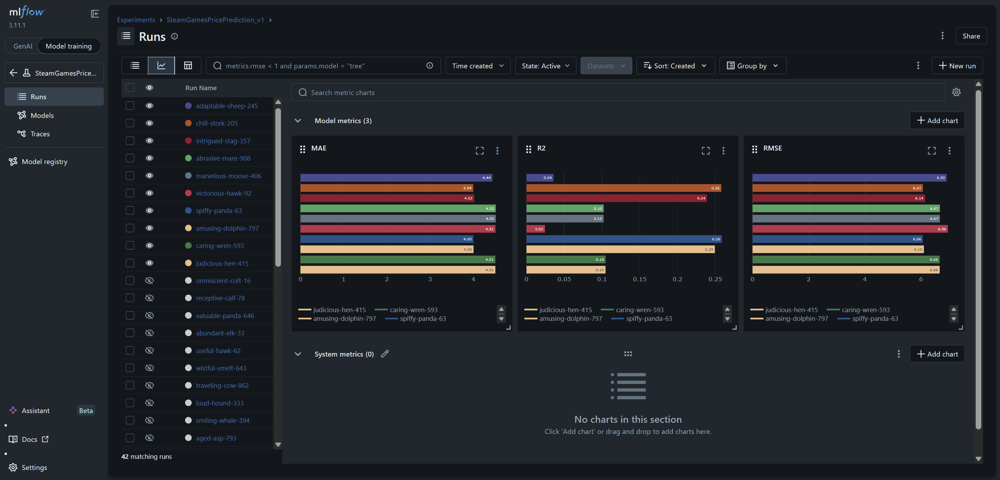
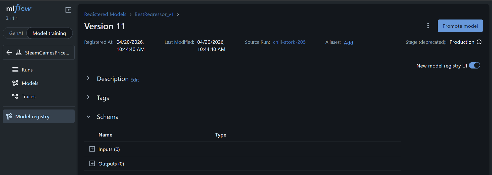

# Phase 2: Experiment Tracking & Model Registry Report

## 1. Local MLflow Setup and Execution

In this phase, all experiments were logged using MLflow on our local tracking server (`http://localhost:5000`).
Five different machine learning models were developed and compared to predict the `price` of Steam games based on 10 engineered features: `average_playtime`, `achievements`, `release_year`, `self_published`, `english`, `is_mac`, `is_multiplayer`, `is_indie`, `is_action`, and `is_early_access`.

The parameters, metrics, and generated artifacts were natively logged into the tracking server.

---

## 2. Screenshot: Experiment Overview

The screenshot below shows the MLflow UI with all runs from the `SteamGamesPricePrediction_v1` experiment. Runs are compared side-by-side across MAE, R² and RMSE metrics using the Chart View.

---

## 3. Comparison of Models

During the experiment, five configurations were assessed and logged as separate MLflow runs:

1. **LinearRegression** (Baseline)
2. **RidgeRegression** (Alpha = 1.0)
3. **RandomForestRegressor** (n_estimators = 50, max_depth = 10)
4. **GradientBoostingRegressor** (n_estimators = 100) ← **Best Model**
5. **KNeighborsRegressor** (n_neighbors = 5)

### Best Model Selection
The best performing model was the **GradientBoostingRegressor**. This was determined automatically by comparing the **Root Mean Squared Error (RMSE)** across all five runs – the run with the lowest RMSE was automatically registered to Production in the MLflow Model Registry.

The metric **RMSE** was chosen as the primary decision factor because it penalizes large prediction errors disproportionately. For a price prediction task, wildly wrong predictions (e.g., predicting €5 for a €60 game) are far more damaging than small consistent errors, making RMSE the most appropriate optimization target.

As visible in the MLflow chart above, `chill-stork-205` (GradientBoostingRegressor) achieved the lowest RMSE (~6.32) compared to linear models (~6.6+) and KNN.

### Metric Discussion
- **MAE (Mean Absolute Error)**: On average, predictions are off by ~€4.00–4.50. This is a reasonable margin for a game whose price may range from €4 to €80.
- **RMSE (Root Mean Squared Error)**: Our best model scores ~6.32. The higher RMSE relative to MAE reveals that some games (particularly mid-tier AAA titles at €40-60) are harder to predict precisely – the model underestimates their price due to limited AAA data in the dataset.
- **R² Score**: Best result ~0.26, meaning roughly 26% of price variance is explained by the 10 engineered features. The remaining variance is driven by brand awareness, marketing budget, and publisher reputation – factors not present in the dataset.

### Dataset Curation Decisions
To improve model quality, strict data hygiene rules were applied before training:
- Games priced **below €4.00** (free-to-play, joke pricing) and **above €80** (outlier DLC bundles) were excluded.
- Games under €6 with **more than 50 achievements** were filtered out as achievement-spam products that distort the pricing signal.
- Training/test split: `80/20` with **Stratified Sampling** across three price tiers (budget: €4–15, mid: €15–40, premium: €40–80) to guarantee equal AAA and indie representation in both sets.

---

## 4. Screenshot: Registered Model

The screenshot below confirms that `BestRegressor_v1` – Version 11 (GradientBoostingRegressor) – is successfully deployed to the **Production** stage in the MLflow Model Registry.

---

## 5. Bonus: Confidence Interval Interpretation (Statsmodels)

A Bonus Step was conducted using `statsmodels` (OLS) to calculate 95% confidence intervals for each regression coefficient. The results were exported as `conf_intervals.csv` and logged as an MLflow artifact on the best run.

**What do these results represent?**
The 95% confidence intervals express the range within which the true coefficient value lies with 95% certainty. For example:
- `average_playtime` has an interval entirely **above zero** → we are 95% confident that longer playtimes correspond to higher prices.
- `is_indie` has an interval entirely **below zero** → Indie-tagged games are statistically cheaper on Steam, with high certainty.
- `release_year` has a **positive interval** → More recent games tend to be priced higher, reflecting inflation and production value trends.

These intervals are also loaded directly into the Streamlit dashboard (Phase 3) and displayed as the `[95% CI: € X – € Y]` range beneath each prediction.
