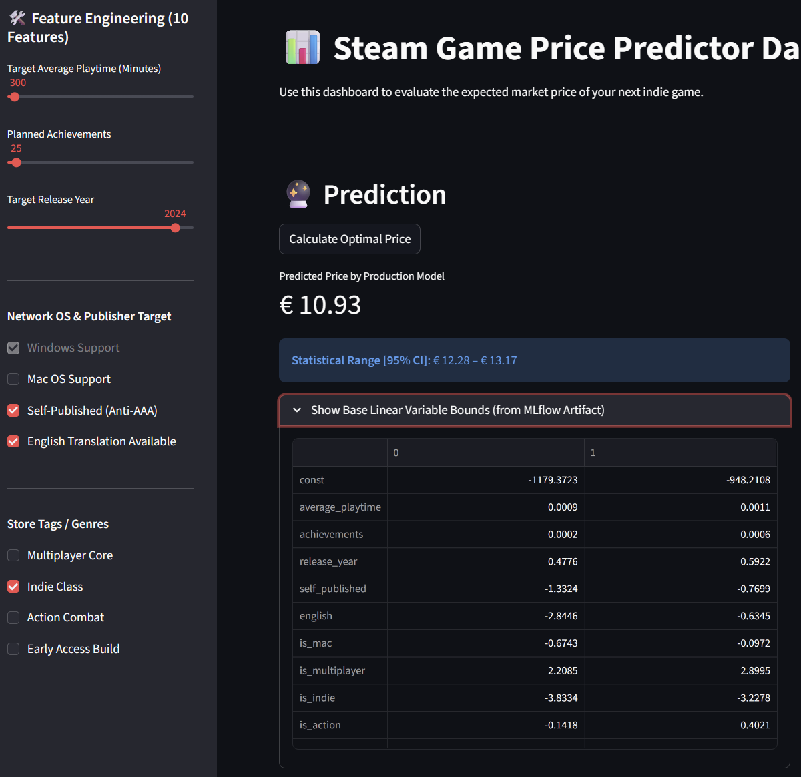
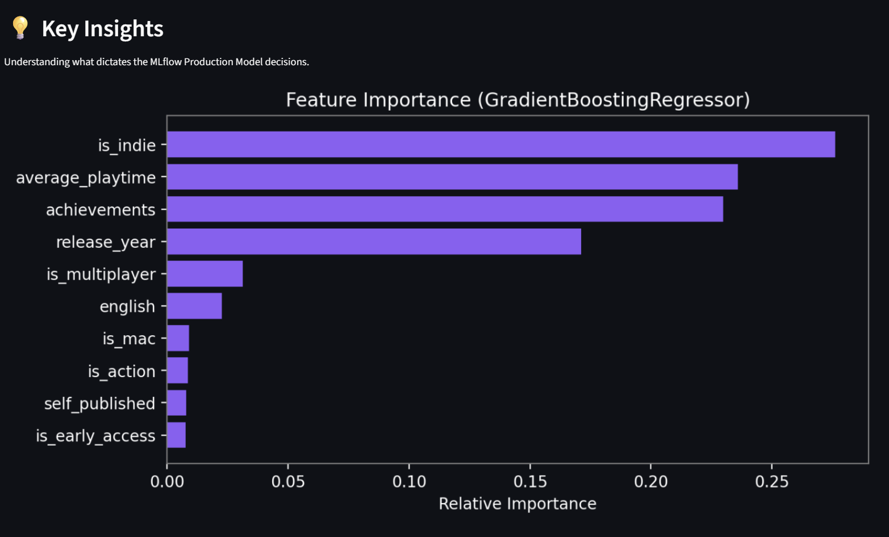

# Phase 3: Interactive Dashboard with Streamlit

## 1. Screenshots of the Running Streamlit App

The screenshots below show the Streamlit dashboard (`http://localhost:8501`) running the `BestRegressor_v1` (GradientBoostingRegressor, Version 11) loaded directly from the local MLflow Model Registry.

### 1.1 – Sidebar Input Area, Prediction Output & Confidence Interval

The left sidebar contains all 10 feature inputs: three numeric sliders (playtime, achievements, release year) and seven binary checkboxes (OS, publisher type, genres). After clicking **Calculate Optimal Price**, the dashboard displays the predicted price from the Production model alongside the 95% Confidence Interval computed via `statsmodels`. The expandable section shows the raw coefficient confidence interval table loaded as an artifact from MLflow.

### 1.2 – Key Insights: Feature Importance Chart

The right panel renders a dark-mode horizontal bar chart (Matplotlib) showing the relative feature importance of the GradientBoostingRegressor. `is_indie`, `average_playtime`, `achievements`, and `release_year` are the dominant predictors, while `is_early_access` and `self_published` have minor but measurable impact.

---

## 2. Architecture Overview

### Model Fetching
The Streamlit application connects to the local MLflow backend (`http://localhost:5000`) via `mlflow.sklearn.load_model(model_uri="models:/BestRegressor_v1/Production")`. The `@st.cache_resource` decorator ensures the model is loaded **only once** on startup and reused for all subsequent prediction requests – eliminating reload latency on every slider interaction.

Additionally, the app downloads the `conf_intervals.csv` artifact from the same Production run and caches it for display in the expandable "Base Linear Variable Bounds" section.

### Execution Flow
1. The user adjusts values in `st.sidebar` (e.g., Target Average Playtime, Planned Achievements, genre flags).
2. On every change, Streamlit reconstructs a 1-row Pandas DataFrame matching the exact 10-feature schema the model was trained on.
3. On button click, the DataFrame is passed to `model.predict(input_data)` – the GradientBoostingRegressor returns the estimated price.
4. **(Bonus)**: Simultaneously, the cached `statsmodels` OLS model evaluates the same input via `lr_sm.get_prediction(sm_input).summary_frame(alpha=0.05)` to extract `mean_ci_lower` and `mean_ci_upper`, displayed as the 95% Confidence Interval beneath the prediction.

---

## 3. Discussion & Analysis of Key Insights

The **Feature Importance** chart (GradientBoostingRegressor) reveals the following hierarchy:

| Feature | Relative Importance | Interpretation |
|---|---|---|
| `is_indie` | ~0.27 (highest) | Indie genre is the single strongest price predictor – Indie games are consistently cheaper on Steam |
| `average_playtime` | ~0.23 | Longer gameplay justifies higher pricing – strongly correlated with production budget |
| `achievements` | ~0.22 | Achievement count reflects content depth and completion incentives |
| `release_year` | ~0.17 | More recent releases command higher prices due to inflation and higher production standards |
| `is_multiplayer` | ~0.03 | Online multiplayer adds modest value |
| `english` | ~0.02 | English localisation slightly correlates with larger-budget international releases |
| `is_mac`, `is_action`, `self_published`, `is_early_access` | < 0.02 each | Minor but retained for their combined marginal contribution |

### Why GradientBoosting Outperformed RandomForest
Unlike Random Forests (which average parallel decision trees), Gradient Boosting constructs trees **sequentially**, each correcting the residual errors of its predecessor. This allows the model to specifically focus learning effort on difficult-to-predict games (mid-tier AAA at €30–60), resulting in a lower RMSE compared to all other candidates.

### Sensible Future Developments
- **Publisher tier metadata**: Adding a binary "AAA Publisher" flag (EA, Ubisoft, Bethesda) would allow the model to reliably distinguish €60 blockbusters from €20 indie games.
- **NLP on game descriptions**: A lightweight text embedding of the game's store description could capture genre nuance beyond the simple binary genre flags currently used.
- **Continuous retraining pipeline**: Connecting the MLflow registry to periodic retraining runs as new Steam pricing data becomes available would keep the model relevant over time.
